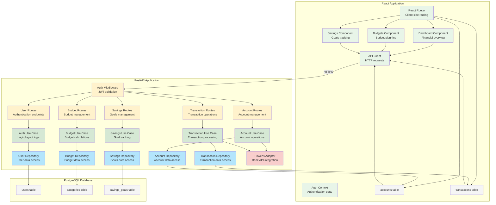

# C4 Component Diagram

## Component Overview

This diagram shows the key components within each container and their interactions.

## Component Descriptions

### Frontend Components

- **React Router**: Handles client-side navigation
- **Auth Context**: Manages authentication state across the app
- **Dashboard**: Main financial overview page
- **Accounts**: Account listing and management
- **Transactions**: Transaction history and categorization
- **Budgets**: Budget creation and monitoring
- **Savings**: Savings goals tracking
- **API Client**: Axios-based HTTP client for backend communication

### Backend Components

#### Routes (Controllers)
- **Auth Middleware**: JWT token validation
- **User/Account/Transaction/Budget/Savings Routes**: REST API endpoints

#### Use Cases (Business Logic)
- **Auth/Account/Transaction/Budget/Savings Use Cases**: Application business rules

#### Repositories (Data Access)
- **User/Account/Transaction/Budget/Savings Repositories**: Database abstraction layer

#### Adapters
- **Powens Adapter**: Integration with external banking API

### Database Tables

- **users**: User accounts and authentication
- **accounts**: Bank account information
- **transactions**: Financial transactions
- **categories**: Budget categories
- **savings_goals**: Savings targets and progress

## Clean Architecture Layers

The backend follows Clean Architecture principles:

1. **Entities** (Core business objects)
2. **Use Cases** (Application business rules)
3. **Interface Adapters** (Controllers, Repositories, External APIs)
4. **Frameworks & Drivers** (FastAPI, Database connections)