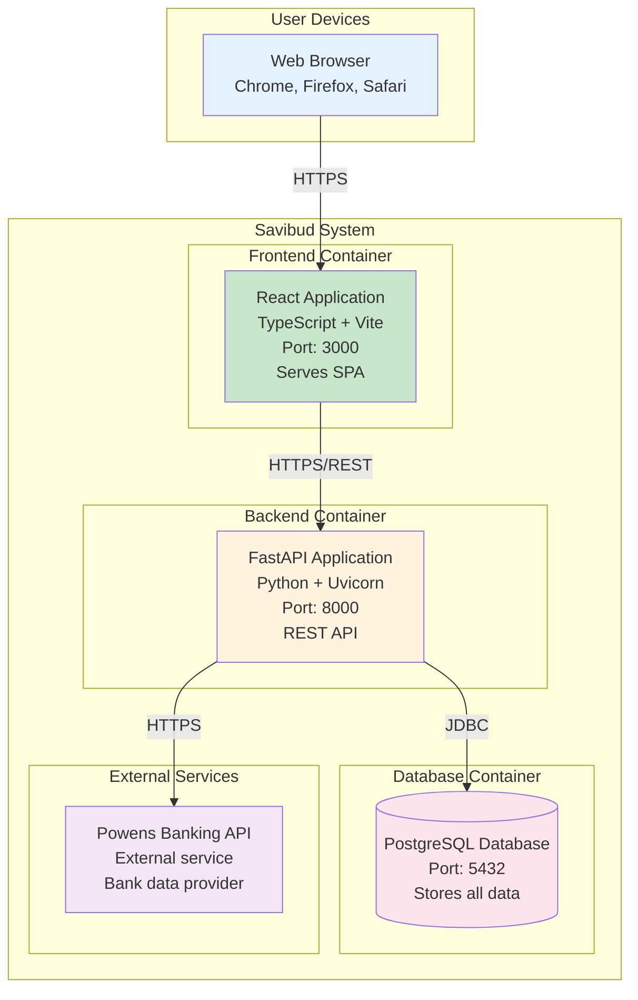

# C4 Container Diagram

## Container Overview

This diagram shows the high-level technology choices and how containers communicate.

## Container Descriptions

### React Application (Frontend)
- **Technology**: React 18, TypeScript, Vite, Tailwind CSS
- **Purpose**: Provides the user interface for managing personal finances
- **Responsibilities**:
  - Display account balances and transactions
  - Allow budget creation and monitoring
  - Enable savings goal management
  - Handle user authentication

### FastAPI Application (Backend)
- **Technology**: FastAPI, Python 3.11, SQLModel, Alembic
- **Purpose**: Implements business logic and data persistence
- **Responsibilities**:
  - User authentication and authorization
  - Account and transaction management
  - Budget and savings goal logic
  - Powens API integration
  - Database operations

### PostgreSQL Database
- **Technology**: PostgreSQL 15+
- **Purpose**: Persistent storage for all application data
- **Responsibilities**:
  - Store user accounts and profiles
  - Maintain transaction history
  - Track budgets and categories
  - Store savings goals and progress

### Powens Banking API
- **Technology**: External REST API
- **Purpose**: Provides access to French banking institutions
- **Responsibilities**:
  - Account balance synchronization
  - Transaction history retrieval
  - Real-time financial data updates

## Technology Decisions

- **Frontend**: React for component reusability, TypeScript for type safety
- **Backend**: FastAPI for high performance, Python for rapid development
- **Database**: PostgreSQL for ACID compliance and complex queries
- **Styling**: Tailwind CSS for utility-first approach
- **Build Tool**: Vite for fast development and optimized production builds