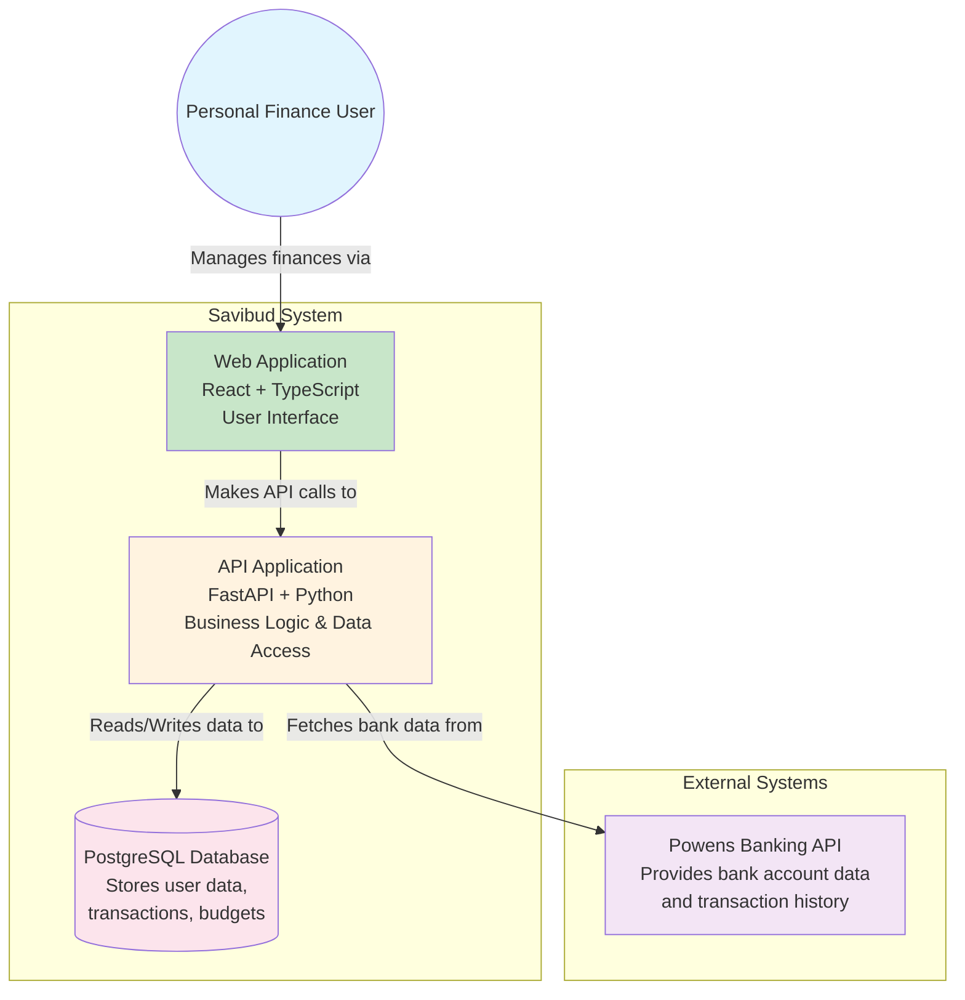

# C4 Context Diagram

## System Context

This diagram shows Savibud in relation to its users and external systems.

## Key Relationships

- **User**: Individuals managing their personal finances
- **Web Application**: Frontend interface for user interaction
- **API Application**: Backend providing business logic and data management
- **Powens API**: External banking service for account synchronization
- **Database**: Persistent storage for all application data

## Quality Attributes

- **Usability**: Intuitive interface for non-technical users
- **Performance**: Fast response times for financial data
- **Security**: Secure handling of financial information
- **Reliability**: Consistent data synchronization
- **Scalability**: Support for growing user base
